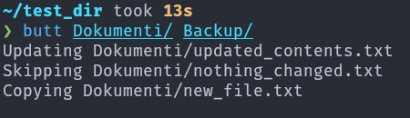

# Back-Up Transfer Tool

Transfer files between two existing directories.

**Add to path.**

## Usage

```bash
butt <source-path> <destination-path>
```

Example:

```bash
butt Dokumenti/ Backup/
```

## Screenshot


